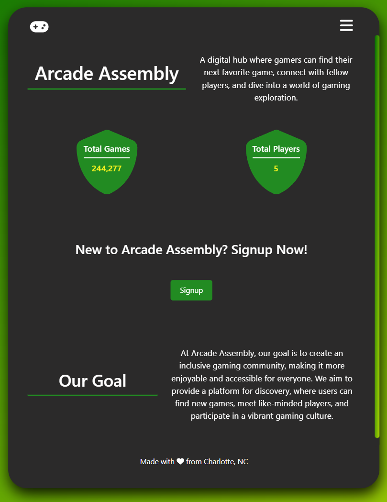

[](https://opensource.org/licenses/MIT)
# Arcade Assembly
 Our goal is to make a more inclusive gaming community that is both enjoyable and accessible for everyone. We aim to provide a platform for discovery, where users can find new games, meet like-minded players, and participate in a vibrant gaming culture.

## Table of Contents
- [Project Description](#description)
- [Installation](#installation)
- [Usage](#usage)
- [License](#license)
- [Questions](#questions)

## Description
For this final group project we were tasked with creating a MERN-stack single-page application from scratch, combining a scalable MongoDB back end, GraphQL API, Express.js and Node.js server with a React front end.

With that, Arcade Assembly was born 🚀

```md
AS A passionate gamer 
I WANT an immersive community where I can connect and team up with fellow gamers to organize sessions
SO THAT I can have better gaming experience while exploring a wide range of titles from popular to obscure
```

## Installation
For installation instructions please visit the github repo https://github.com/brandta-1/please-hire-us to clone!

A few environment variables are needed in a `.env` file as well:
* `CLIENT_ID` : "q0vcnxc11kiip39llm98wo6w3bfq6s"
* `CLIENT_SECRET` : "eily7nr1vv7j5t1z0wmk210bndf4m9"
* `ACCESS_TOKEN` : "w49j1sferxu1ocshsmvvrn3ort7g10"


## Usage
In order to use this app you will first need to navigate to the **`root`** folder and open up a terminal. When the terminal is open, run the command **`npm run install`** to install your dependencies in both the client and server folder. Next you will type **`npm run build`** into our terminal which will cd to the client folder and run the build command. Once that is finished, you will type **`npm run develop`** which will concurrently cd to the server and run watch while also doing the same to client with start. Once that is completed both your front and back end are up & running, so you are good to go!

Deployed Site: https://arcade-assembly-c977bb949035.herokuapp.com/




## License
MIT
https://opensource.org/licenses/MIT

## Questions
For any questions please reach out to us via GitHub

https://github.com/brandta-1
<br>
https://github.com/Cjmoye30
<br>
https://github.com/joshbaileydev513
<br>
https://github.com/WesBaker0